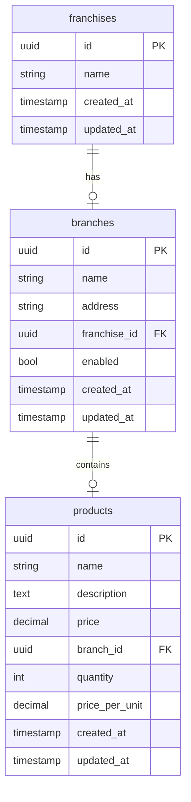

# Manage Franchises - API

## Descripción

Este proyecto es una API Reactiva para gestionar franquicias utilizando Spring WebFlux. La arquitectura de la aplicación está basada en **Arquitectura Hexagonal**, lo que permite una separación clara de las diferentes capas de la aplicación y facilita la adaptación de la infraestructura.

La API también está documentada con **OpenAPI**, lo que permite generar una documentación interactiva para probar y explorar los endpoints disponibles.

## Stack

- **Backend**: Spring WebFlux (reactivo)
- **Base de datos**: PostgreSQL (R2DBC)
- **Arquitectura**: Hexagonal Architecture
- **Documentación**: OpenAPI
- **Construcción**: Maven
- **Contenedor**: Docker
- **Java**: 17

## Configuración de la Base de Datos

La aplicación utiliza PostgreSQL para almacenar los datos. A continuación, se presenta el DDL inicial para crear las tablas necesarias:

```sql
-- Crear tabla de franquicias
CREATE TABLE public.franchises (
id uuid DEFAULT gen_random_uuid() NOT NULL,
"name" varchar(255) NOT NULL,
created_at timestamp DEFAULT CURRENT_TIMESTAMP NULL,
updated_at timestamp DEFAULT CURRENT_TIMESTAMP NULL,
CONSTRAINT franchises_pkey PRIMARY KEY (id)
);

-- Crear tabla de sucursales
CREATE TABLE public.branches (
id uuid DEFAULT gen_random_uuid() NOT NULL,
"name" varchar(255) NOT NULL,
address varchar(255) NULL,
franchise_id uuid NULL,
enabled bool DEFAULT true NULL,
created_at timestamp DEFAULT CURRENT_TIMESTAMP NULL,
updated_at timestamp DEFAULT CURRENT_TIMESTAMP NULL,
CONSTRAINT branches_pkey PRIMARY KEY (id),
CONSTRAINT branches_franchise_id_fkey FOREIGN KEY (franchise_id) REFERENCES public.franchises(id)
);

-- Crear tabla de productos
CREATE TABLE public.products (
id uuid DEFAULT gen_random_uuid() NOT NULL,
"name" varchar(255) NOT NULL,
description text NULL,
price numeric(10, 2) NULL,
branch_id uuid NULL,
quantity int4 DEFAULT 0 NULL,
price_per_unit numeric(10, 2) NULL,
created_at timestamp DEFAULT CURRENT_TIMESTAMP NULL,
updated_at timestamp DEFAULT CURRENT_TIMESTAMP NULL,
CONSTRAINT products_pkey PRIMARY KEY (id),
CONSTRAINT products_branch_id_fkey FOREIGN KEY (branch_id) REFERENCES public.branches(id)
);
```

## Ejecutar en Local

### Configuración Local

1. **Base de datos**: Asegúrate de tener PostgreSQL corriendo en tu máquina. Puedes usar Docker para levantar un contenedor de PostgreSQL o usar una base de datos local existente.

2. **Configura el archivo `application.yaml`**:
   Ajusta los valores en tu archivo `src/main/resources/application.yaml` con las configuraciones locales para conectar con la base de datos PostgreSQL

3. **Ejecutar la API**:
    - Si no deseas usar Docker, puedes ejecutar la API localmente utilizando Maven:

      ```bash
      mvn clean spring-boot:run
      ```

    - Si prefieres usar Docker, primero debes construir la imagen de Docker y luego ejecutarla. Aquí están los pasos:

### Construcción y Ejecución con Docker

1. **Construir la imagen Docker**:
   En el directorio raíz del proyecto, ejecuta el siguiente comando para construir la imagen Docker:

   ```bash
   docker build . -t manage_franchises
   ```

2. **Ejecutar la imagen Docker**:
   Una vez que la imagen esté construida, ejecuta el contenedor con el siguiente comando:

   ```bash
   docker run -p 8080:8080 --env-file {ENV_FILE} manage_franchises
   ```

   Esto iniciará el contenedor y hará que la API esté disponible en `http://localhost:8080`.

## Documentación de la API

La API está documentada con **OpenAPI**. Puedes acceder a la documentación interactiva a través de la siguiente URL una vez que la aplicación esté corriendo: `http://localhost:8080/swagger-ui.html`

## Diagrama Entidad-Relación


