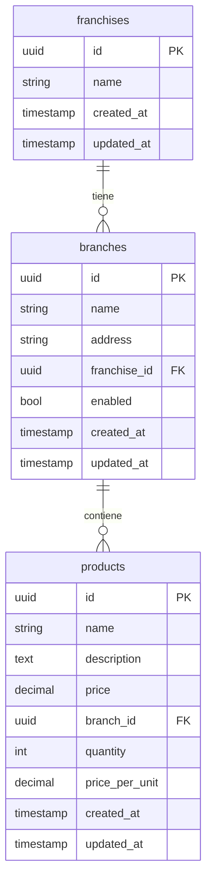

[](https://github.com/JheisonM/manage_franchises/actions/workflows/automatic-test.yml)


# Gestión de Franquicias - API Reactiva

Una API REST moderna y reactiva para la gestión de franquicias construida con Spring WebFlux. Este proyecto implementa los principios de la **Arquitectura Hexagonal** para asegurar una clara separación de responsabilidades y código mantenible.

## 🚀 Características

- Endpoints reactivos usando Spring WebFlux
- Implementación de Arquitectura Hexagonal
- Integración con base de datos PostgreSQL
- Documentación OpenAPI
- Soporte para Docker
- Validación y manejo de errores incorporados

## 🛠️ Tecnologías Utilizadas


## 📋 Requisitos Previos

- Java 17 o superior
- Maven 3.8.4+
- Docker (opcional)
- PostgreSQL 13.3+

## 🚦 Comenzando

### Configuración de Desarrollo Local

1. **Clonar el repositorio**
   ```bash
   git clone https://github.com/JheisonM/manage_franchises.git
   cd manage_franchises
   ```

2. **Configurar Base de Datos**
   
   Ejecutar el siguiente script SQL para crear las tablas necesarias:
   ```sql
   -- Crear tabla de franquicias
   CREATE TABLE public.franchises (
     id uuid DEFAULT gen_random_uuid() NOT NULL,
     "name" varchar(255) NOT NULL,
     created_at timestamp DEFAULT CURRENT_TIMESTAMP NULL,
     updated_at timestamp DEFAULT CURRENT_TIMESTAMP NULL,
     CONSTRAINT franchises_pkey PRIMARY KEY (id)
   );

   -- Crear tabla de sucursales
   CREATE TABLE public.branches (
     id uuid DEFAULT gen_random_uuid() NOT NULL,
     "name" varchar(255) NOT NULL,
     address varchar(255) NULL,
     franchise_id uuid NULL,
     enabled bool DEFAULT true NULL,
     created_at timestamp DEFAULT CURRENT_TIMESTAMP NULL,
     updated_at timestamp DEFAULT CURRENT_TIMESTAMP NULL,
     CONSTRAINT branches_pkey PRIMARY KEY (id),
     CONSTRAINT branches_franchise_id_fkey FOREIGN KEY (franchise_id) REFERENCES public.franchises(id)
   );

   -- Crear tabla de productos
   CREATE TABLE public.products (
     id uuid DEFAULT gen_random_uuid() NOT NULL,
     "name" varchar(255) NOT NULL,
     description text NULL,
     price numeric(10, 2) NULL,
     branch_id uuid NULL,
     quantity int4 DEFAULT 0 NULL,
     price_per_unit numeric(10, 2) NULL,
     created_at timestamp DEFAULT CURRENT_TIMESTAMP NULL,
     updated_at timestamp DEFAULT CURRENT_TIMESTAMP NULL,
     CONSTRAINT products_pkey PRIMARY KEY (id),
     CONSTRAINT products_branch_id_fkey FOREIGN KEY (branch_id) REFERENCES public.branches(id)
   );
   ```

3. **Configurar application.yaml**
   
   Actualizar `src/main/resources/application.yaml` con tu configuración de base de datos:
   ```yaml
   spring:
     r2dbc:
       url: r2dbc:postgresql://localhost:5432/tu_base_de_datos
       username: tu_usuario
       password: tu_contraseña
   ```

4. **Compilar y Ejecutar**
   ```bash
   mvn clean install
   mvn spring-boot:run
   ```

### 🐳 Despliegue con Docker

1. **Construir imagen Docker**
   ```bash
   docker build -t manage_franchises .
   ```

2. **Ejecutar contenedor**
   ```bash
   docker run -p 8080:8080 --env-file .env manage_franchises
   ```

   Variables de entorno en `.env`:
   ```
   PROFILE=deploy
   SPRING_R2DBC_URL=r2dbc:postgresql://host.docker.internal:5432/tu_base_de_datos
   SPRING_R2DBC_USERNAME=tu_usuario
   SPRING_R2DBC_PASSWORD=tu_contraseña
   ```

## 📚 Documentación 

Una vez que la aplicación esté en ejecución, accede a la documentación OpenAPI en:
- Swagger UI: `http://localhost:8080/swagger-ui.html`
- OpenAPI JSON: `http://localhost:8080/v3/api-docs`

## 🧪 Ejecutar Pruebas

```bash
mvn test
```

## 📊 Modelo de Datos


